# ManualUsuario.md

# Manual de Usuario

## Selenio - Reproductor Musical Premium

---

# 1. Introducción
Bienvenido a **Selenio**, un reproductor musical de escritorio desarrollado para ofrecer una experiencia moderna, organizada y eficiente en la gestión de bibliotecas musicales personales.

Además de reproducir archivos de audio, Selenio integra herramientas avanzadas como la creación de playlists circulares, un historial de reproducción, una cola de espera, un sistema de favoritos, karaoke sincronizado con letras descargadas automáticamente y un mecanismo de exportación e importación de playlists mediante codificación propia.

Su interfaz oscura está diseñada para reducir la fatiga visual durante largas sesiones de uso, mientras que las estructuras internas del sistema optimizan el rendimiento incluso cuando se administran grandes colecciones de música.

El objetivo de este manual es guiar al usuario en el uso correcto de cada una de las funciones disponibles dentro de la aplicación.

---

# 2. Requisitos del Sistema
Antes de utilizar Selenio, verifique que su equipo cumpla con los siguientes requisitos.

## Requisitos Mínimos

* Sistema Operativo: Windows 10 o superior (64 bits).
* Java Runtime Environment (JRE) versión 11 o superior.
* Memoria RAM: 2 GB libres.
* Espacio disponible en disco: 500 MB.

## Requisitos Recomendados

* Memoria RAM: 4 GB o superior.
* Resolución mínima: 1366 × 768 píxeles.
* Conexión a Internet estable.
* Aceleración gráfica habilitada.

El cumplimiento de estos requisitos permitirá una reproducción fluida y una mejor experiencia visual.

---

# 3. Interfaz Gráfica y Navegación
Al iniciar la aplicación, se mostrará la ventana principal de Selenio con un diseño oscuro inspirado en interfaces modernas de servicios de música.
La ventana principal está dividida en diferentes áreas funcionales:

* Biblioteca musical.
* Playlists.
* Favoritos.
* Historial.
* Panel de reproducción.
* Karaoke.
* Cola de reproducción.

## Navegación Horizontal
A diferencia de otras aplicaciones, algunas secciones utilizan desplazamiento horizontal.
Para navegar entre ellas:

1. Coloque el cursor sobre el panel correspondiente.
2. Utilice la rueda del mouse.
3. El movimiento vertical será transformado automáticamente en desplazamiento horizontal.

Este comportamiento permite visualizar grandes cantidades de información sin saturar la interfaz.

> **Figura 1. Ventana principal de Selenio**
> 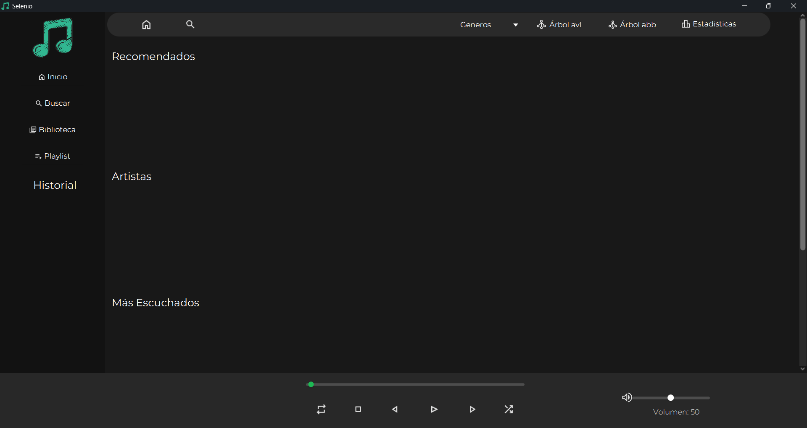

---

# 4. Escaneo e Importación de la Biblioteca Musical
Selenio permite importar colecciones completas de música mediante la selección de carpetas.
El sistema analiza automáticamente todos los archivos compatibles encontrados dentro del directorio seleccionado y sus subcarpetas.

## Procedimiento

1. Presione el botón **Importar Música**.
2. Se abrirá el explorador de carpetas del sistema operativo.
3. Navegue hasta la carpeta donde almacena su música.
4. Seleccione la carpeta principal.
5. Presione **Aceptar**.
6. Espere mientras el sistema procesa la información.

Durante este proceso, Selenio obtiene automáticamente:

* Nombre de la canción.
* Artista.
* Álbum.
* Duración.
* Carátula incrustada.

Una vez finalizado el análisis, las canciones aparecerán ordenadas dentro de la biblioteca musical.

> **Figura 2. Selección de carpeta musical**
> 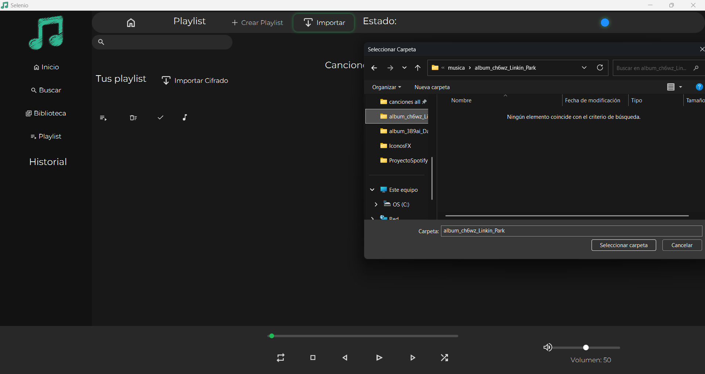

## Recomendaciones

* Evite mover o eliminar los archivos después de importarlos.
* Mantenga organizadas las carpetas musicales.
* Espere a que el proceso finalice antes de realizar nuevas importaciones.

---

# 5. Biblioteca Musical Interactiva
La biblioteca constituye el núcleo principal de Selenio.
Cada canción es presentada mediante celdas visuales que muestran información relevante para facilitar su identificación.

## Información mostrada
Cada elemento incluye:

* Carátula del álbum.
* Nombre de la canción.
* Nombre del artista.
* Nombre del álbum.
* Estado de favorito.

Las portadas son administradas mediante un sistema interno de caché que mejora el rendimiento y reduce tiempos de carga.

## Reproducir una canción
Para iniciar la reproducción:

1. Localice la canción deseada.
2. Realice doble clic sobre ella.

El sistema comenzará inmediatamente la reproducción y actualizará todos los componentes relacionados.

## Acciones disponibles
Desde la biblioteca también es posible:

* Agregar canciones a playlists.
* Marcar favoritos.
* Iniciar el karaoke.
* Incorporar canciones a la cola de reproducción.

> **Figura 3. Biblioteca musical**
> 

---

# 6. Controles de Reproducción
En la parte inferior de la ventana principal se encuentran los controles encargados de administrar el flujo de reproducción.

## Botón Reproducir / Pausar
Permite iniciar o detener temporalmente la reproducción de la pista actual.
Si la canción se encuentra pausada, continuará desde el mismo punto donde fue detenida.

---

## Botón Siguiente
Reproduce la siguiente canción disponible
Dependiendo del contexto, puede obtener la siguiente pista desde:

* La playlist activa.
* La cola de reproducción.
* La biblioteca general.

Cuando una playlist se encuentra configurada en reproducción continua, al finalizar la última canción se volverá automáticamente a la primera pista.

---

## Botón Anterior
Permite regresar a la canción escuchada anteriormente.
Esta función utiliza el historial interno del sistema para recuperar la reproducción previa.

---

## Barra de Progreso
Muestra el tiempo transcurrido y la duración total de la canción.
El usuario puede:

1. Presionar sobre cualquier punto de la barra.
2. Arrastrar el indicador.
3. Saltar directamente al instante deseado de la reproducción.

---

## Control de Volumen
Permite ajustar la intensidad del sonido según las preferencias del usuario.
Desplace el control hacia:

* La derecha para aumentar el volumen.
* La izquierda para disminuirlo.

> **Figura 4. Controles de reproducción**
> 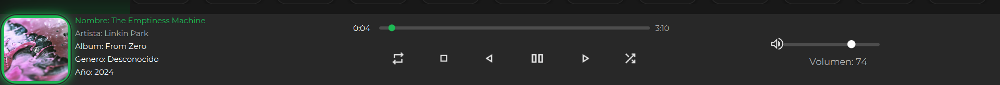

---

# 7. Gestión Avanzada de Playlists
Las playlists permiten organizar canciones de acuerdo con los gustos y necesidades del usuario.
Cada playlist funciona como una colección independiente de la biblioteca principal.

## Crear una Playlist

1. Acceda a la sección de playlists.
2. Ingrese un nombre para la nueva lista.
3. Confirme la creación.

La playlist aparecerá inmediatamente en el panel correspondiente.

## Agregar Canciones

1. Seleccione una canción desde la biblioteca.
2. Abra el menú de opciones disponible.
3. Elija **Agregar a Playlist**.
4. Seleccione la playlist de destino.

Las canciones permanecerán en la biblioteca original y, simultáneamente, formarán parte de la playlist seleccionada.

> **Figura 5. Creación y administración de playlists**
>
> 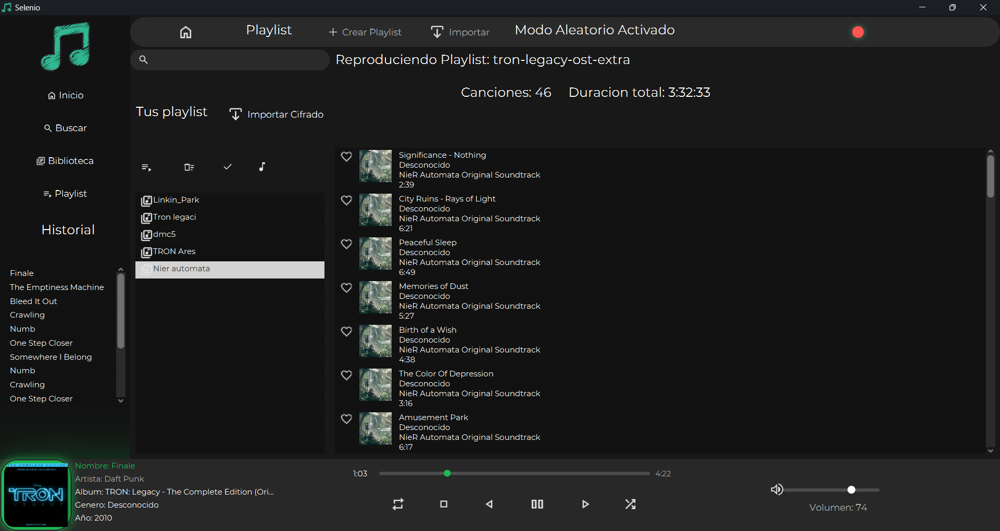

# 7. Gestión Avanzada de Playlists (Continuación)

## Reordenamiento Dinámico (Drag & Drop)
Selenio permite modificar el orden de reproducción de una playlist de forma visual e intuitiva mediante la técnica de arrastrar y soltar.

### Procedimiento
1. Seleccione la canción que desea mover.
2. Mantenga presionado el botón izquierdo del mouse.
3. Arrastre la canción hasta la nueva posición deseada.
4. Suelte el botón del mouse para confirmar el cambio.

El sistema actualizará automáticamente el orden interno de la lista sin necesidad de guardar manualmente los cambios.

## Reproducción Continua
Una característica especial de Selenio es que las playlists pueden comportarse como listas continuas.
Cuando la reproducción alcanza la última canción:

* El sistema regresará automáticamente a la primera pista.
* La reproducción continuará sin interrupciones.
* El usuario podrá disfrutar sesiones prolongadas sin reiniciar manualmente la lista.

> **Figura 6. Reordenamiento mediante arrastrar y soltar**
>
>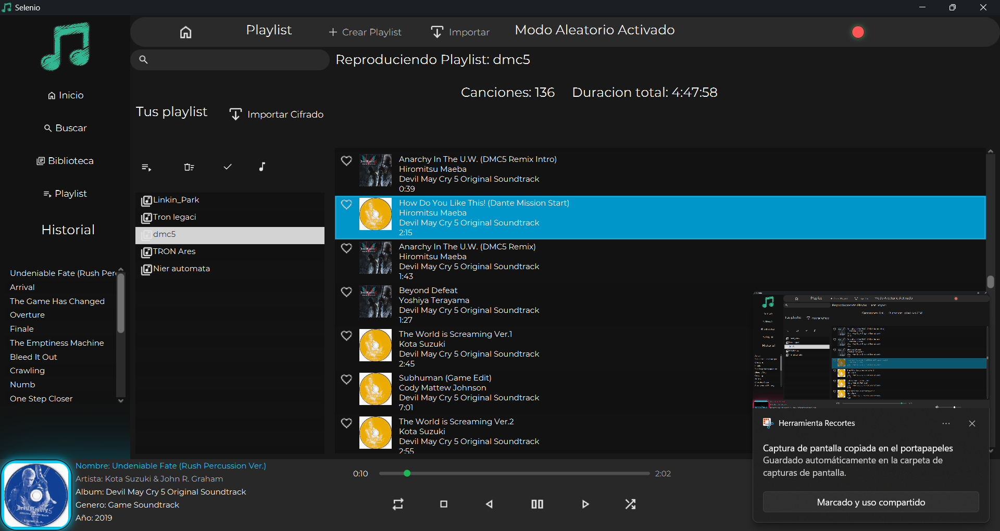
>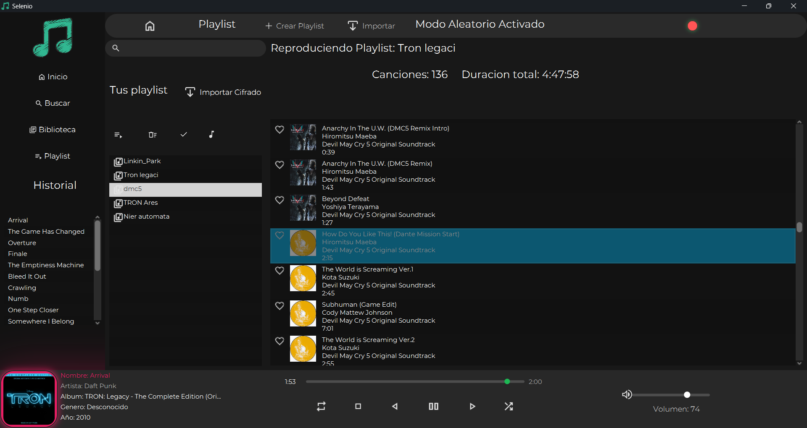

---

# 8. Favoritos, Cola de Reproducción e Historial
Además de la reproducción tradicional, Selenio incorpora herramientas que permiten administrar mejor la experiencia musical diaria.

---

## Favoritos
La sección de favoritos almacena accesos rápidos a las canciones más importantes para el usuario.

### Marcar una canción como favorita

1. Localice la canción dentro de la biblioteca.
2. Presione el icono correspondiente a favoritos.
3. El sistema actualizará inmediatamente su estado.

La canción aparecerá posteriormente dentro del apartado de favoritos.

### Beneficios

* Acceso rápido.
* Organización personalizada.
* Filtrado inmediato de canciones preferidas.

> **Figura 7. Sección de favoritos**
> 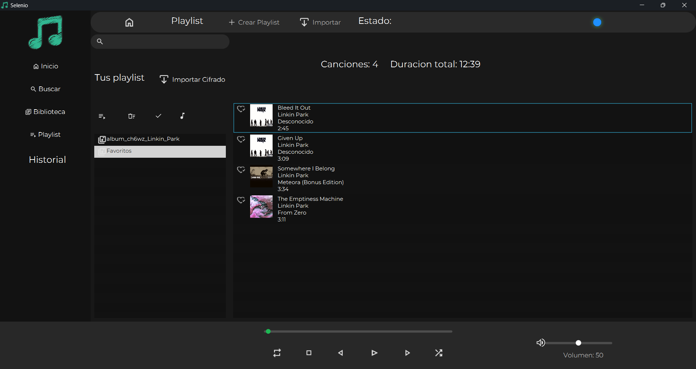

---

## Cola de Reproducción
La cola permite programar temporalmente canciones que se desean escuchar a continuación.
Su funcionamiento sigue el principio:

> **La primera canción agregada será la primera en reproducirse.**

### Agregar canciones a la cola

1. Seleccione una Playlist.
2. Elija la opción **Reproducir Cola**.


### Ventajas

* No modifica el orden de las playlists.
* Ideal para reuniones o sesiones improvisadas.
* Facilita la planificación inmediata de reproducción.

> **Figura 8. Cola de reproducción**
> 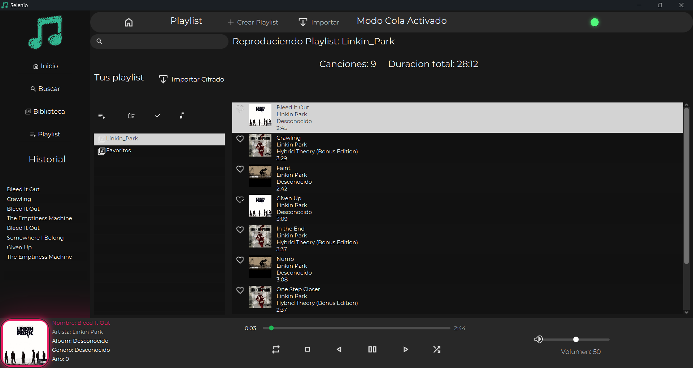

---

## Historial de Reproducción
El historial registra automáticamente las canciones escuchadas durante la sesión.
Cada vez que una canción comienza a reproducirse, queda almacenada en el historial interno.

### Utilidad

* Recordar canciones reproducidas recientemente.
* Volver rápidamente a una pista anterior.
* Consultar la actividad musical de la sesión actual.

> **Figura 9. Historial de reproducción**
> 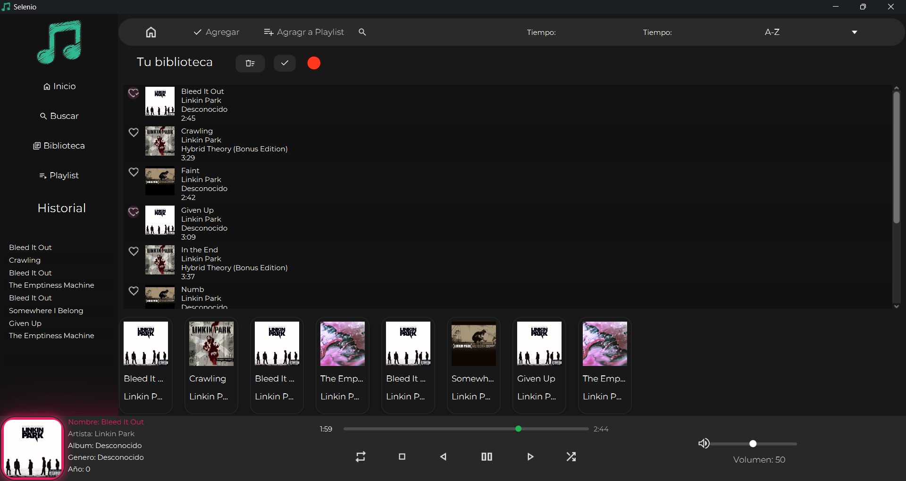

---

# 9. Modo Karaoke Sincronizado
Una de las funciones más llamativas de Selenio es su sistema de karaoke integrado.
Cuando se dispone de letras compatibles, estas son sincronizadas automáticamente con el tiempo de reproducción de la canción.

## Funcionamiento
Al iniciar una canción:

1. El sistema intenta localizar letras sincronizadas.
2. Si existen archivos compatibles o letras disponibles en línea, estas son cargadas automáticamente.
3. El panel de karaoke reemplaza temporalmente otros elementos visuales.
4. Los versos se muestran conforme avanza la reproducción.

---

## Experiencia Visual
El modo karaoke incorpora animaciones suaves para mejorar la experiencia del usuario.
Entre ellas destacan:

* Aparición progresiva de versos.
* Transiciones visuales.
* Actualización automática del texto activo.
* Resaltado de la línea correspondiente al momento actual de la canción.

---

## Requisitos
Para que la descarga automática funcione correctamente:

* Debe existir conexión a Internet.
* La canción debe estar correctamente identificada mediante sus metadatos.
* Debe existir una letra disponible en el servicio consultado.

> **Figura 10. Panel de karaoke**
> 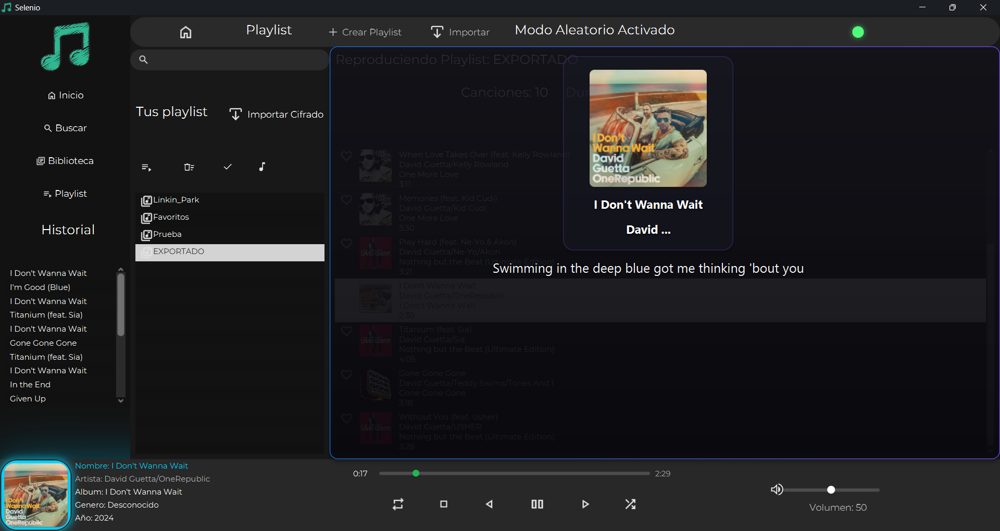

---

# 10. Exportación e Importación de Playlists
Selenio permite respaldar y transferir playlists mediante archivos cifrados.
Esta característica resulta especialmente útil cuando se desea migrar información entre equipos o conservar copias de seguridad.

---

## Exportar una Playlist
Para exportar una lista:

1. Seleccione la playlist deseada.
2. Haga clic 3 veces sobre la playlist.
3. Elija la ubicación donde se almacenará el archivo.
4. Confirme la operación.

El sistema generará automáticamente un archivo de texto protegido.

---

## Sistema de Codificación
Los archivos exportados utilizan un mecanismo propio de codificación basado en símbolos de la tabla periódica.
Además, incorporan una firma interna denominada:

```
BETOMIPASTOR
```
Esta firma permite validar la integridad de la información durante la importación.

### Importante
No modifique manualmente el contenido del archivo exportado, ya que cualquier alteración podría impedir su recuperación posterior.

---

## Importar una Playlist
Para restaurar una lista previamente exportada:

1. Presione el botón **Importar Cifrado**.
2. Seleccione el archivo correspondiente.
3. Espere mientras el sistema verifica la información.
4. Una vez validado el contenido, la playlist será incorporada nuevamente al sistema.

> **Figura 11. Exportación e importación de playlists**
> 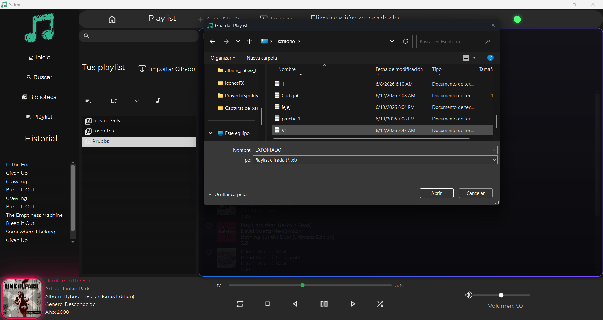
> 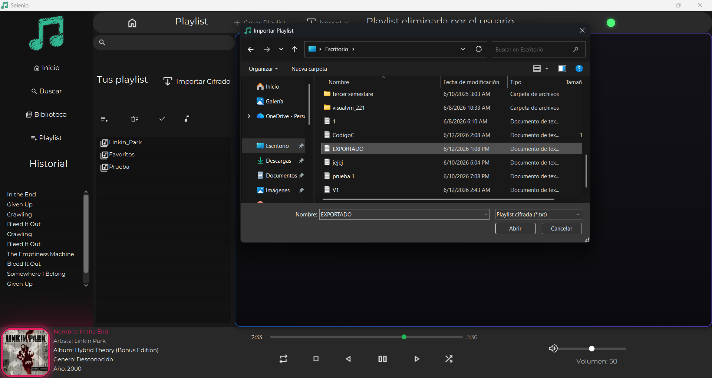
> 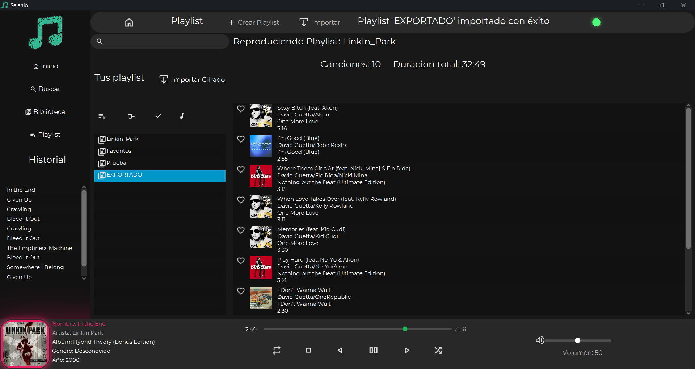

---

# 11. Solución de Problemas Frecuentes

## Problema 1: Una canción no se reproduce

### Posibles causas

* El archivo fue eliminado.
* La ruta original cambió.
* El archivo fue renombrado.

### Solución
Ejecute nuevamente el proceso de importación sobre la carpeta correspondiente para actualizar la información.

---

## Problema 2: El karaoke no muestra letras

### Posibles causas

* No existe conexión a Internet.
* No hay letras disponibles.
* Los metadatos del archivo son incorrectos.

### Solución

* Verifique su conexión.
* Revise el nombre del artista y la canción.
* Intente volver a reproducir la pista.

---

## Problema 3: La interfaz responde lentamente

### Posibles causas

* Memoria RAM insuficiente.
* Muchos programas ejecutándose simultáneamente.
* Importación masiva de canciones.

### Solución

* Espere a que finalicen las tareas activas.
* Cierre aplicaciones innecesarias.
* Reinicie Selenio si el problema persiste.

---

## Problema 4: Una playlist exportada no puede importarse

### Posibles causas

* El archivo fue modificado manualmente.
* El contenido del archivo está incompleto.

### Solución
Utilice únicamente archivos generados directamente por Selenio y evite editarlos con programas externos.

---

# 12. Conclusión
Selenio ha sido diseñado para ofrecer mucho más que un simple reproductor musical. Su combinación de una interfaz moderna, herramientas avanzadas de organización y características exclusivas como el karaoke sincronizado, las playlists continuas y el sistema de respaldo cifrado convierten la administración musical en una experiencia práctica y agradable.

A través del uso adecuado de las funciones descritas en este manual, el usuario podrá gestionar grandes colecciones musicales, personalizar su experiencia de escucha y aprovechar todas las capacidades que ofrece la aplicación de manera eficiente y segura.

---

## Soporte y Recomendaciones Finales

* Mantenga organizada su biblioteca musical.
* Realice respaldos periódicos de sus playlists.
* Verifique la conexión a Internet para aprovechar el karaoke automático.
* Evite modificar manualmente archivos exportados.
* Actualice periódicamente su entorno Java para asegurar la compatibilidad del sistema.

Gracias por utilizar **Selenio - Reproductor Musical **.
