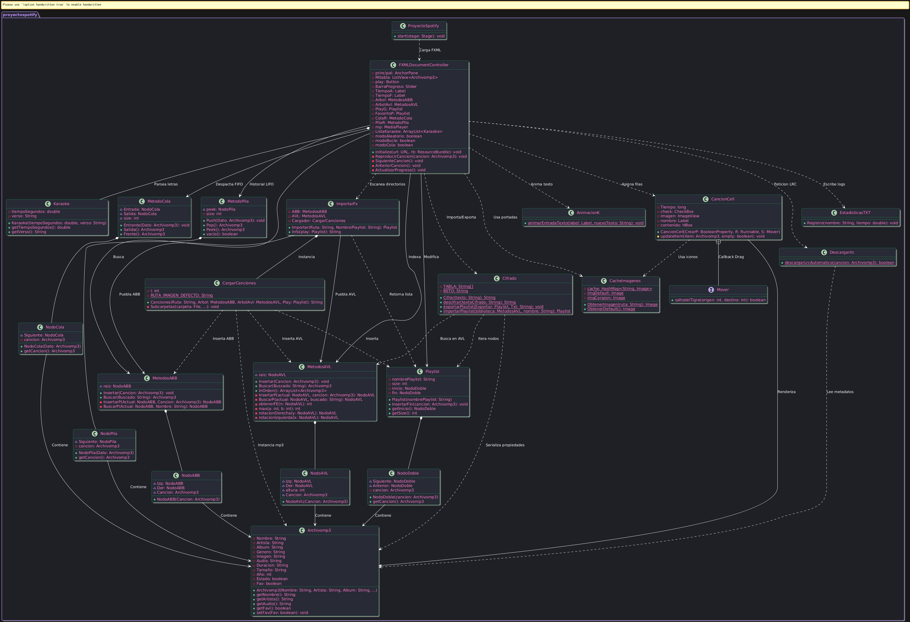

# ManualTecnico.md

# Manual Técnico
## Selenio - Reproductor Musical

---
# 1. Introducción
Selenio es una aplicación de escritorio desarrollada en Java que tiene como propósito administrar y reproducir archivos musicales mediante una interfaz gráfica amigable construida con JavaFX. A diferencia de un reproductor convencional, el sistema incorpora estructuras de datos implementadas manualmente y funcionalidades adicionales como karaoke sincronizado, cifrado de playlists, estadísticas de reproducción y visualización gráfica de árboles.

El presente manual técnico describe la arquitectura del sistema, las tecnologías utilizadas, el funcionamiento interno de los módulos más importantes y las estructuras de datos que permiten el correcto funcionamiento de la aplicación.

---
# 2. Objetivos del Sistema

## Objetivo General
Desarrollar un reproductor musical de escritorio que permita gestionar una biblioteca de canciones utilizando estructuras de datos personalizadas y herramientas complementarias que mejoren la experiencia del usuario.

## Objetivos Específicos
* Permitir la importación y reproducción de archivos musicales.
* Implementar estructuras de datos sin utilizar colecciones avanzadas del lenguaje como solución principal.
* Facilitar la organización mediante playlists y favoritos.
* Incorporar un historial y cola de reproducción.
* Mostrar letras sincronizadas mediante un modo karaoke.
* Exportar e importar playlists utilizando un mecanismo de cifrado.
* Generar estadísticas relacionadas con el uso del sistema.
* Visualizar estructuras arbóreas utilizando Graphviz.

---
# 3. Descripción General del Sistema
Selenio funciona como un gestor musical completo. El usuario puede importar canciones desde el sistema operativo y administrarlas desde una interfaz centralizada.
La información de las canciones es almacenada utilizando distintas estructuras de datos dependiendo de la funcionalidad requerida. Por ejemplo, las playlists utilizan listas doblemente enlazadas, mientras que la biblioteca puede representarse mediante árboles de búsqueda para optimizar ciertas operaciones.
La aplicación está orientada a demostrar la integración entre interfaces gráficas modernas y estructuras de datos desarrolladas manualmente.

---
# 4. Tecnologías Utilizadas

## Java
Java constituye el lenguaje principal del proyecto. Toda la lógica del sistema, manipulación de datos y control de eventos fue desarrollada utilizando este lenguaje.

### Ventajas de utilizar Java
* Portabilidad entre sistemas operativos.
* Amplia documentación.
* Integración directa con JavaFX.
* Gestión automática de memoria mediante el recolector de basura.

---
## JavaFX
JavaFX es el framework utilizado para construir la interfaz gráfica del sistema.
Su función principal es separar la lógica de negocio de la presentación visual.
Entre las características aprovechadas se encuentran:

* Ventanas.
* Botones.
* Etiquetas.
* Paneles.
* ListView.
* Eventos del usuario.
* Animaciones.
* Reproducción multimedia.

---
## FXML
FXML permite definir la interfaz mediante archivos XML.
Gracias a esta separación:

* El diseño visual puede modificarse sin alterar la lógica principal.
* El controlador administra únicamente el comportamiento.
* Se mejora la organización del proyecto.

---
## CSS
Los archivos CSS fueron utilizados para personalizar la apariencia visual del sistema.
Entre los elementos modificados se encuentran:

* Tipografías.
* Colores.
* Bordes.
* Efectos visuales.
* Distribución estética de componentes.

---
## Graphviz
Graphviz es una herramienta externa utilizada para generar representaciones gráficas de estructuras arbóreas.
Dentro del sistema permite visualizar:

* Árboles ABB.
* Árboles AVL.

El procedimiento consiste en:

1. Generar un archivo DOT.
2. Ejecutar Graphviz desde Java.
3. Convertir el archivo DOT en una imagen PNG.
4. Mostrar la imagen al usuario.

Esta funcionalidad facilita el análisis y validación del comportamiento de los árboles implementados.

---
## Gson
La biblioteca Gson fue utilizada para trabajar con información estructurada en formato JSON.
Su utilización simplifica la conversión entre objetos Java y datos provenientes de servicios externos.
Entre sus beneficios destacan:

* Facilidad de uso.
* Serialización automática.
* Deserialización eficiente.

---
## mp3agic
mp3agic es una biblioteca destinada a la manipulación de metadatos presentes en archivos MP3.
Gracias a esta herramienta fue posible obtener información como:

* Nombre de la canción.
* Artista.
* Álbum.
* Duración.
* Portadas incrustadas.

Estos datos enriquecen la experiencia del usuario dentro de la biblioteca musical.

---
# 5. Arquitectura General del Proyecto
La arquitectura de Selenio sigue una organización por responsabilidades.
Puede dividirse en cuatro grandes bloques.

## Diagrama de Clases UML del Sistema
A continuación se presenta el diagrama de clases que ilustra la relación entre la interfaz gráfica, los controladores, la lógica de negocio y las estructuras de datos del reproductor:

>

## Interfaz Gráfica
Encargada de la interacción con el usuario.
Componentes principales:

* Archivos FXML.
* Hojas de estilo CSS.
* Ventanas JavaFX.

Responsabilidades:

* Mostrar información.
* Capturar eventos.
* Actualizar componentes visuales.

---

## Controladores
Los controladores funcionan como intermediarios entre la interfaz y la lógica del sistema.
Sus funciones incluyen:

* Procesar acciones del usuario.
* Actualizar vistas.
* Invocar métodos de estructuras de datos.
* Gestionar la reproducción multimedia.

El controlador principal concentra gran parte del comportamiento de la aplicación.

---

## Lógica del Negocio
Contiene las clases encargadas del procesamiento interno.
Entre ellas destacan:

* Gestión de playlists.
* Manejo de canciones.
* Estadísticas.
* Cifrado.
* Karaoke.
* Descarga de letras.

Esta capa representa el núcleo funcional del sistema.

---

## Estructuras de Datos
Las estructuras implementadas manualmente permiten almacenar y organizar la información.
Estas estructuras fueron diseñadas específicamente para satisfacer necesidades particulares del sistema.
Las más importantes son:

* Lista doblemente enlazada.
* Cola.
* Pila.
* Árbol ABB.
* Árbol AVL.
# 6. Estructuras de Datos Implementadas
Uno de los aspectos más importantes de Selenio es el uso de estructuras de datos desarrolladas manualmente para administrar la información del sistema. Cada estructura fue seleccionada según las necesidades específicas de la funcionalidad que debía implementar.

---

## 6.1 Lista Doblemente Enlazada
La lista doblemente enlazada constituye una de las estructuras más utilizadas dentro del proyecto.
A diferencia de un arreglo tradicional, cada nodo almacena referencias tanto al siguiente elemento como al anterior, permitiendo recorrer la estructura en ambos sentidos.

### Estructura del nodo
Cada nodo contiene:

* La información de la canción.
* Una referencia al nodo siguiente.
* Una referencia al nodo anterior.

### Operaciones implementadas

* Inserción de canciones.
* Eliminación de canciones.
* Recorrido hacia adelante.
* Recorrido hacia atrás.
* Búsqueda de elementos.
* Reordenamiento de canciones.

### Uso dentro del sistema
Esta estructura fue utilizada principalmente para:

* Playlists.
* Navegación entre canciones.
* Reorganización mediante arrastrar y soltar.

### Ventajas

* Inserciones eficientes.
* Eliminaciones sencillas.
* Navegación bidireccional.
* Flexibilidad para reorganizar elementos.

### Desventajas

* Mayor consumo de memoria debido a dos referencias por nodo.
* Acceso secuencial a los elementos.

---

## 6.2 Cola de Reproducción
La cola es una estructura basada en el principio FIFO (First In, First Out), es decir, el primer elemento en entrar es el primero en salir.

### Funcionamiento
Cuando el usuario agrega canciones a la cola:

1. La canción se inserta al final.
2. Las canciones esperan su turno.
3. Una vez reproducida la canción actual, se extrae el siguiente elemento.

### Operaciones implementadas

* Encolar.
* Desencolar.
* Consultar el primer elemento.
* Verificar si está vacía.

### Aplicación en Selenio
La cola administra las canciones pendientes de reproducción.
Gracias a esta estructura se logra una experiencia similar a la de reproductores comerciales.

---

## 6.3 Pila de Historial
La pila funciona bajo el principio LIFO (Last In, First Out).
El último elemento insertado será el primero en retirarse.

### Funcionamiento
Cada vez que el usuario reproduce una canción:

1. La canción se registra en el historial.
2. Se almacena en la parte superior de la pila.
3. Puede consultarse posteriormente.

### Operaciones implementadas

* Push.
* Pop.
* Peek.
* Verificación de pila vacía.

### Uso dentro del sistema
Se utiliza para construir el historial de reproducción.
Esto permite recuperar rápidamente las canciones escuchadas recientemente.

---

## 6.4 Árbol Binario de Búsqueda (ABB)
El ABB es una estructura jerárquica donde cada nodo cumple la siguiente regla:

* Los valores menores se almacenan a la izquierda.
* Los valores mayores se almacenan a la derecha.

### Información almacenada
Cada nodo contiene:

* Datos de la canción.
* Referencia al hijo izquierdo.
* Referencia al hijo derecho.

### Operaciones implementadas

* Inserción.
* Búsqueda.
* Eliminación.
* Recorridos.

### Tipos de recorrido

#### Preorden
Visita:

1. Nodo actual.
2. Subárbol izquierdo.
3. Subárbol derecho.

#### Inorden
Visita:

1. Subárbol izquierdo.
2. Nodo actual.
3. Subárbol derecho.

Permite obtener los elementos ordenados.

#### Postorden
Visita:

1. Subárbol izquierdo.
2. Subárbol derecho.
3. Nodo actual.

### Uso dentro del sistema
El ABB fue utilizado para organizar canciones y demostrar el funcionamiento de estructuras arbóreas.

---

## 6.5 Árbol AVL
El árbol AVL es una versión auto balanceada del árbol binario de búsqueda.
Su principal objetivo es evitar que el árbol se vuelva demasiado inclinado, manteniendo tiempos eficientes de búsqueda.

### Características

* Mantiene equilibrio automáticamente.
* Controla la diferencia de alturas.
* Realiza rotaciones cuando es necesario.

### Operaciones implementadas

* Inserción balanceada.
* Eliminación balanceada.
* Búsqueda.
* Recorridos.

### Rotaciones utilizadas

#### Rotación simple izquierda
Se aplica cuando el desequilibrio ocurre hacia la derecha.

#### Rotación simple derecha
Se aplica cuando el desequilibrio ocurre hacia la izquierda.

#### Rotación doble izquierda-derecha
Corrige desequilibrios más complejos.

#### Rotación doble derecha-izquierda
Permite recuperar el equilibrio cuando la inserción ocurre en configuraciones específicas.

### Beneficios

* Búsquedas más rápidas.
* Menor profundidad.
* Mejor rendimiento que un ABB desbalanceado.

---

# 7. Gestión de Archivos Musicales
La clase encargada de representar las canciones almacena la información necesaria para que el sistema pueda trabajar correctamente con cada archivo.
Entre los atributos más importantes se encuentran:

* Nombre de la canción.
* Ruta del archivo.
* Artista.
* Álbum.
* Duración.
* Imagen asociada.
* Estado de favorito.

Cuando una canción es importada, estos datos son extraídos automáticamente para facilitar su administración posterior.

---
# 8. Sistema de Reproducción
El sistema de reproducción constituye el núcleo funcional de Selenio.
Su responsabilidad consiste en controlar el flujo completo de audio.

### Funciones principales

* Iniciar reproducción.
* Pausar canciones.
* Reanudar reproducción.
* Detener audio.
* Cambiar de pista.
* Ajustar volumen.

### Flujo de funcionamiento

1. El usuario selecciona una canción.
2. El controlador recibe el evento.
3. Se inicializa el reproductor multimedia.
4. Se actualizan los componentes visuales.
5. Se registra la reproducción en el historial.
6. Se verifican letras sincronizadas.
7. La reproducción continúa hasta finalizar o ser interrumpida.
# 9. Sistema de Playlists
Las playlists representan uno de los componentes más utilizados por el usuario, ya que permiten organizar las canciones de acuerdo con diferentes criterios personales, como géneros, estados de ánimo o artistas favoritos.

## Funcionamiento General
Una playlist es una colección independiente de canciones almacenada mediante una lista doblemente enlazada. Esto permite modificar su contenido sin afectar la biblioteca principal del sistema.
El flujo general es el siguiente:

1. El usuario crea una nueva playlist.
2. El sistema genera una estructura vacía.
3. Las canciones seleccionadas se insertan dentro de la lista.
4. El usuario puede modificar el orden de reproducción.
5. La playlist puede reproducirse de forma individual.

## Operaciones Disponibles
### Creación
Permite generar una nueva lista indicando un nombre identificador.

### Inserción de canciones
Agrega elementos provenientes de la biblioteca musical.

### Eliminación
Retira canciones específicas sin eliminarlas del sistema principal.

### Reordenamiento
Permite reorganizar el orden mediante operaciones de arrastre y colocación.

### Recorrido
Se utiliza para mostrar todos los elementos contenidos en la lista.

## Ventajas del diseño implementado
* Independencia respecto a la biblioteca principal.
* Flexibilidad para reorganizar canciones.
* Eliminación eficiente de elementos.
* Navegación bidireccional.

---

# 10. Sistema de Favoritos
El sistema de favoritos permite identificar rápidamente aquellas canciones que poseen mayor relevancia para el usuario.

## Funcionamiento
Cada objeto correspondiente a una canción posee un atributo que indica si ha sido marcada como favorita.
Cuando el usuario activa esta opción:

1. Se modifica el estado interno del objeto.
2. Se actualiza la interfaz gráfica.
3. La canción puede visualizarse posteriormente dentro de la sección de favoritos.

## Beneficios

* Acceso inmediato a canciones frecuentes.
* Mejor organización de la biblioteca.
* Experiencia más personalizada.

---

# 11. Historial de Reproducción
El historial registra las canciones escuchadas durante el uso del sistema.

## Objetivo
Permitir que el usuario consulte rápidamente las reproducciones recientes.

## Implementación
La estructura utilizada corresponde a una pila.
Cada vez que una canción inicia su reproducción:

1. Se inserta en la pila.
2. El elemento más reciente queda en la parte superior.
3. El historial puede mostrarse siguiendo el orden correspondiente.

## Ventajas

* Registro automático.
* Acceso rápido a reproducciones recientes.
* Implementación sencilla.

---

# 12. Sistema de Karaoke
Una de las características distintivas de Selenio es la incorporación de un modo karaoke.
Este módulo sincroniza la letra de una canción con el tiempo de reproducción del audio.

## Objetivos

* Mostrar la letra correspondiente.
* Resaltar el verso adecuado.
* Actualizar el contenido en tiempo real.

## Funcionamiento General
Cuando una canción comienza a reproducirse:

1. El sistema busca un archivo de letras asociado.
2. Si existe, procesa su contenido.
3. Se extraen las marcas de tiempo.
4. Se sincroniza cada línea con el reproductor.
5. La interfaz actualiza automáticamente el texto mostrado.

## Compatibilidad con archivos LRC
El formato LRC almacena:

* Tiempos específicos.
* Fragmentos de letra.
* Información organizada cronológicamente.

Ejemplo conceptual:

```
[00:15.30] Primera línea
[00:20.10] Segunda línea
```

Gracias a este formato, el sistema puede determinar exactamente cuándo debe mostrarse cada fragmento.

## Ventajas

* Mejora la experiencia del usuario.
* Facilita el seguimiento de la canción.
* Añade una funcionalidad poco común en reproductores académicos.

---

# 13. Descarga Automática de Letras
Además del soporte para archivos locales, Selenio incorpora la capacidad de obtener letras desde servicios externos.

## Flujo de funcionamiento

1. Se identifica el nombre de la canción.
2. Se obtiene información del artista.
3. Se realiza una consulta al servicio correspondiente.
4. Se procesa la respuesta recibida.
5. Se almacena la letra obtenida.
6. Se activa la sincronización del karaoke.

## Ventajas

* Reduce la intervención manual.
* Amplía la cantidad de canciones compatibles.
* Mejora la usabilidad general.

## Consideraciones

* Requiere conexión a Internet.
* La disponibilidad depende del servicio consultado.
* Algunas canciones pueden no poseer información registrada.

---

# 14. Caché de Imágenes
Durante la importación de canciones es común trabajar con portadas musicales.
Cargar continuamente las mismas imágenes puede afectar el rendimiento del sistema.
Para solucionar este problema se implementó un mecanismo de caché.

## Objetivo
Evitar la carga repetitiva de imágenes previamente utilizadas.

## Funcionamiento

1. Se solicita una imagen.
2. El sistema verifica si ya se encuentra almacenada.
3. Si existe, reutiliza la referencia disponible.
4. Si no existe, la carga y la guarda para usos posteriores.

## Beneficios

* Reducción del consumo de recursos.
* Menor tiempo de respuesta.
* Mayor fluidez visual.
* Optimización del uso de memoria.

---

# 15. Sistema de Cifrado para Playlists
Selenio permite exportar playlists utilizando un mecanismo de cifrado implementado dentro del proyecto.

## Objetivo
Proteger la información almacenada durante la exportación.

## Funcionamiento General
Durante la exportación:

1. Se obtiene la información de la playlist.
2. Los datos son transformados mediante el algoritmo implementado.
3. Se genera un archivo de texto cifrado.
4. El usuario puede almacenarlo como respaldo.

Durante la importación:

1. El sistema lee el archivo.
2. Se aplica el proceso inverso.
3. Se recupera la información original.
4. La playlist vuelve a integrarse al sistema.

## Beneficios

* Protección básica de la información.
* Portabilidad entre equipos.
* Recuperación sencilla de listas respaldadas.

---

# 16. Generación de Estadísticas
El sistema registra información relacionada con el uso de la aplicación.

## Datos que pueden almacenarse

* Canciones reproducidas.
* Frecuencia de uso.
* Actividad del usuario.
* Información relevante para análisis posteriores.

## Objetivos

* Comprender patrones de utilización.
* Proporcionar información útil al usuario.
* Facilitar futuras ampliaciones del sistema.

---

# 17. Visualización de Árboles con Graphviz
Para validar el funcionamiento de los árboles implementados, Selenio genera representaciones gráficas utilizando Graphviz.

## Procedimiento

1. Se recorre la estructura correspondiente.
2. Se genera un archivo DOT.
3. Se ejecuta el comando de Graphviz desde Java.
4. Se produce una imagen PNG.
5. La imagen puede visualizarse dentro de la aplicación.

## Utilidad

* Facilita la depuración.
* Permite verificar inserciones y eliminaciones.
* Ayuda a comprender el comportamiento de los árboles.

---

# 18. Consideraciones de Mantenimiento
Para mantener el correcto funcionamiento del sistema se recomienda:

* Documentar cualquier modificación importante.
* Mantener organizada la estructura de paquetes.
* Verificar la compatibilidad de las bibliotecas externas.
* Realizar pruebas después de cambios significativos.
* Evitar alterar directamente las estructuras de datos sin comprender su funcionamiento.

---

# 19. Posibles Mejoras Futuras
Aunque Selenio cumple con los objetivos planteados, existen características que podrían incorporarse en futuras versiones.

Entre ellas destacan:

* Soporte para más formatos de audio.
* Creación de listas inteligentes.
* Sincronización en la nube.
* Ecualizador integrado.
* Sistema de recomendaciones mejorado.
* Modo oscuro configurable.
* Búsquedas más avanzadas.
* Estadísticas gráficas.

---

# 20. Conclusión
Selenio es un proyecto que combina conceptos de programación orientada a objetos, interfaces gráficas y estructuras de datos desarrolladas manualmente para construir un reproductor musical funcional y enriquecido con herramientas complementarias.

La integración de árboles, listas enlazadas, pilas y colas demuestra la aplicación práctica de estructuras fundamentales dentro de un entorno real. Asimismo, funcionalidades como el karaoke, el cifrado de playlists, la generación de estadísticas y la visualización mediante Graphviz convierten al sistema en una solución completa que trasciende las características básicas de un reproductor tradicional.

Este manual técnico tiene como finalidad servir como guía para comprender, mantener y ampliar el sistema en futuras etapas de desarrollo.
